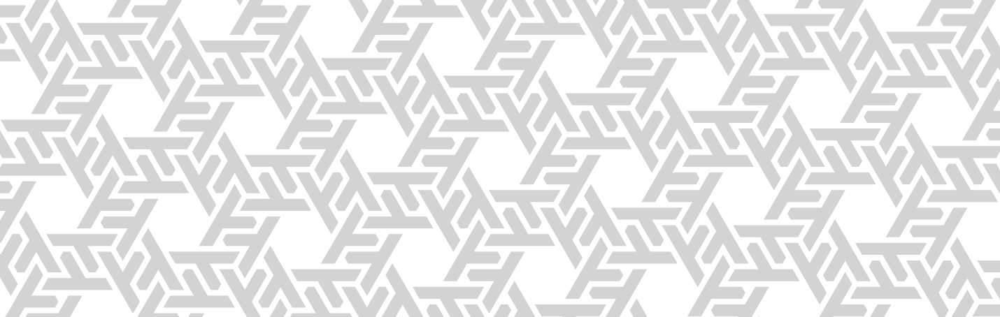
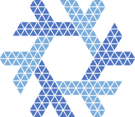
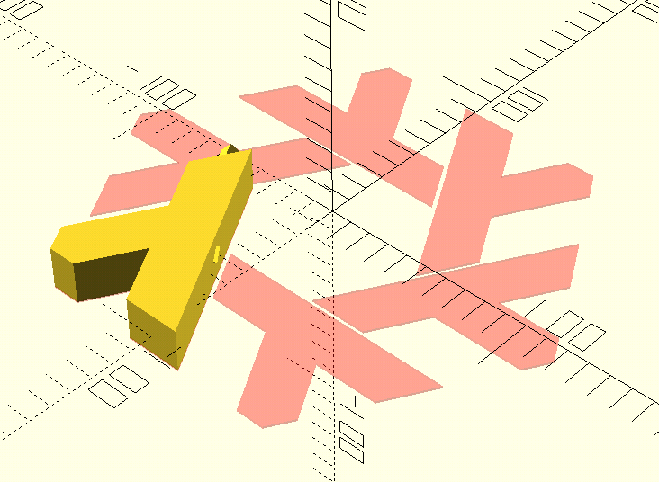

# Precise Nix logo rework (aka genix7000)

Logo versions for use are in ["out" folder](./out)

This is a Nix logo version, generated in OpenSCAD and pinned to a hex grid. Differences between generated and original versions are neglidgible:


*Blue is a newer version, red is an older version*

Here's a "hexgrid" version, which shows the proportions better:



## Why OpenSCAD?

Having most of the logo parametrized allows to generate logos with different weights with ease

```openscad
   for (gap=[1:5]) {
        $gaps = gap * 2;
        translate([(gap - 1) * 160,((gap - 1) % 2) * 160])
        difference()
        render_logo();
    };
```


It also allows to easily animate the logo — [here's an example](./doc/fadeout.mp4) — e.g if you want to have minimalistic plymouth animation.

## 3D Printing

nix.scad can also export several 3D printing models — single-module smaller versions, and separate, composable lambdas — if you wish to build yourself a huge Nix logo.


## Hacking on it

Run `nix-shell -p openscad` if you don't have an OpenSCAD yet, and then open nix.scad in it.

If you wish to export colored logos, modify and use `./export-color-svgs.sh` in this folder.

3D printing models
